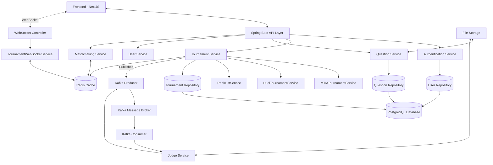
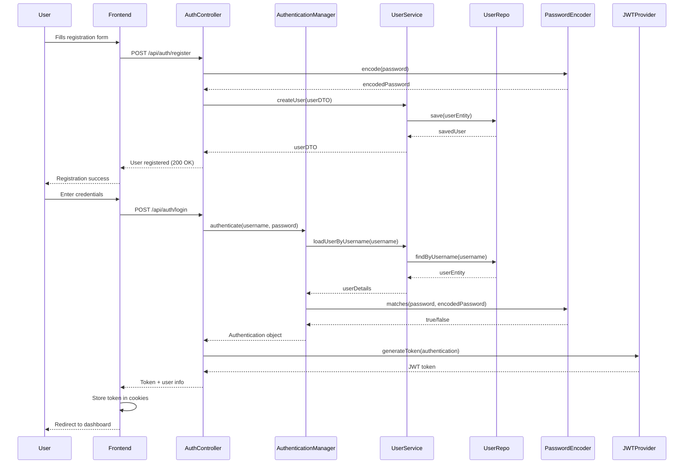
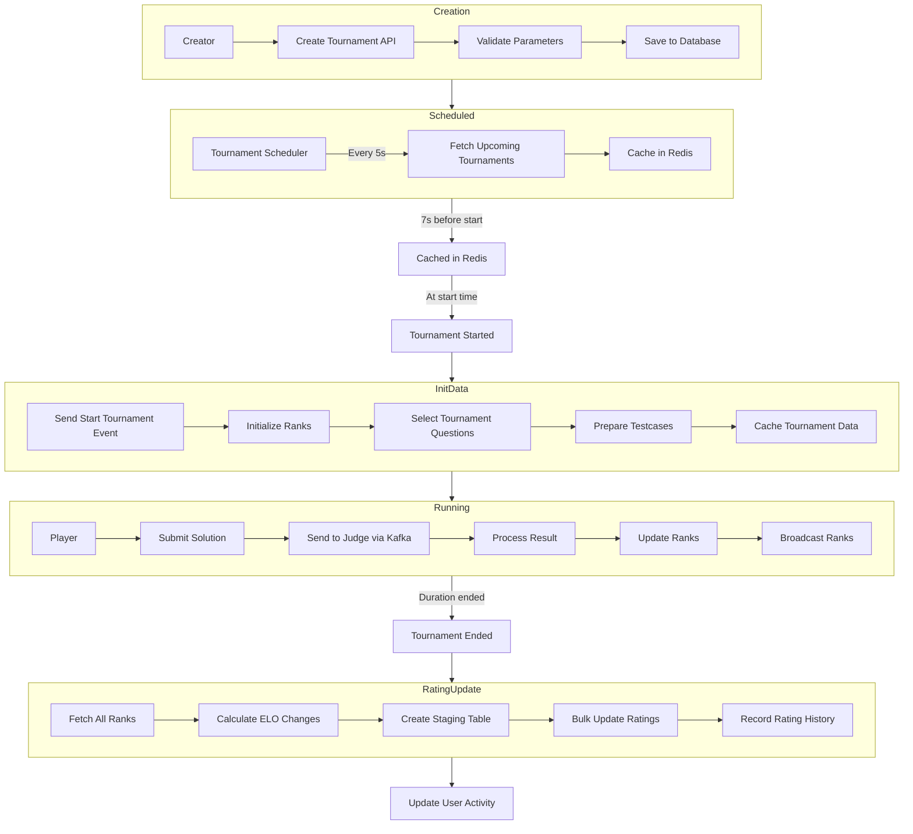
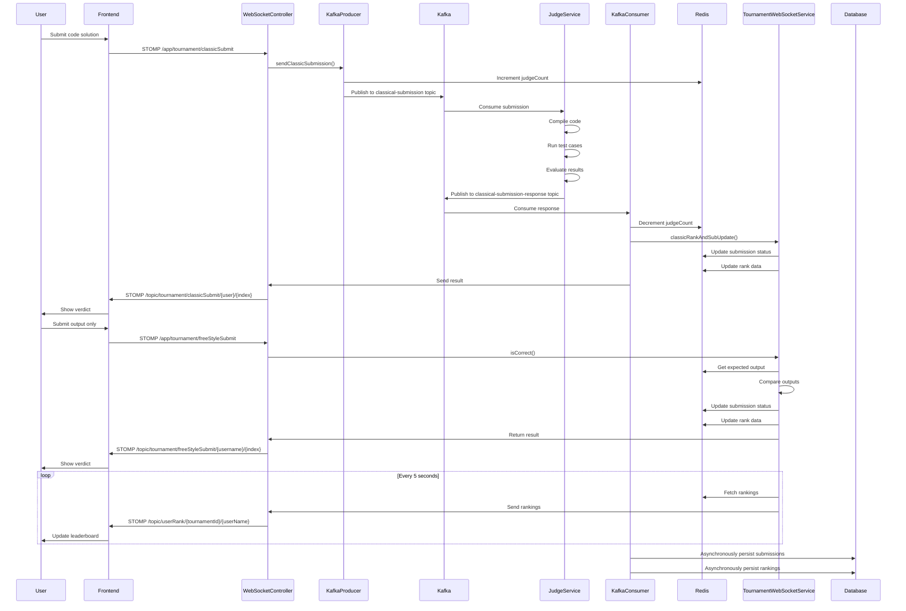
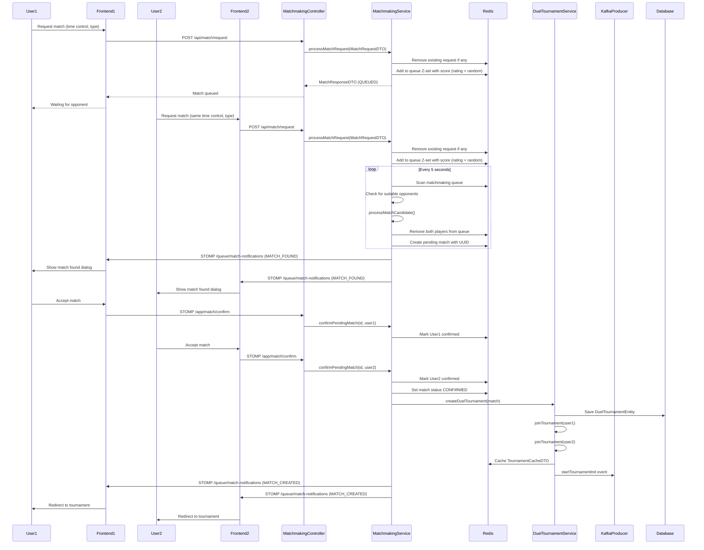
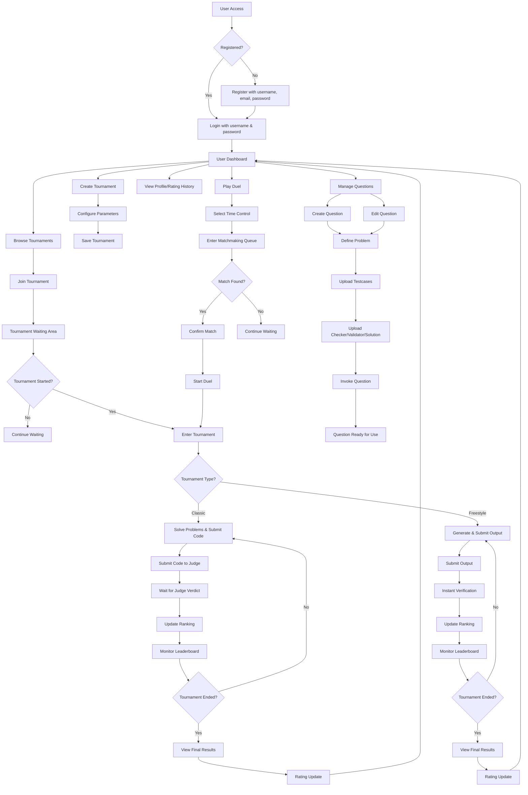

# CodeRush System Architecture

## Key Components:

1. **Frontend**: NextJS-based client application
2. **Backend Services**: Spring Boot microservices
3. **Data Stores**: PostgreSQL for persistence, Redis for caching and real-time data
4. **Message Queue**: Kafka for asynchronous processing
5. **File Storage**: For storing question testcases, solutions, checkers, and validators
6. **WebSocket**: For real-time communication during tournaments

## Communication Patterns:

1. **REST API**: For standard CRUD operations
2. **WebSocket/STOMP**: For real-time updates during tournaments
3. **Kafka**: For asynchronous processing of submissions and tournament events
4. **Redis**: For fast data access, caching, and matchmaking

# Authentication Flow

## Authentication Process:

1. **Registration**: User details are captured, password is hashed with BCrypt, and user entity is persisted
2. **Login**: Username and password are validated, JWT token is generated upon successful authentication
3. **Authorization**: JWT token is included in every subsequent request (REST or WebSocket) for authorization
4. **Security**: Spring Security with JWT for stateless authentication

# Tournament Lifecycle

## Tournament States:

1. **Creation**: Users create tournaments with specific parameters (duration, visibility, type)
2. **Scheduled**: Upcoming tournaments are tracked and cached before start time
3. **Started**: At the exact start time, tournament initialization occurs
4. **Running**: Players solve problems, submit solutions, and rankings are updated in real-time
5. **Ended**: After duration expires, final rankings are established
6. **Rating Update**: Player ratings are recalculated using an ELO-based algorithm
7. **Activity Update**: User activity records are updated for dashboard display

# Submission and Judging Pipeline

## Judging Pipeline Features:

1. **Dual Submission Modes**:
   - Classic mode: Full code submission judged by external service
   - Freestyle mode: Output-only submission checked instantly against expected output

2. **Performance Optimizations**:
   - Redis for real-time data during tournaments
   - Asynchronous persistence to database via Kafka
   - Real-time updates via WebSockets
   
3. **Judging Process**:
   - Code compilation and execution in isolated environment
   - Memory and time constraints enforcement
   - Multiple verdict types (AC, WA, TLE, MLE, RE, CE)
   - Custom checkers for flexible output validation

# Matchmaking System

## Matchmaking Features:

1. **Dynamic Rating-Based Matching**: Finds opponents with similar ratings
2. **Expanding Search Range**: Increases rating range tolerance over time
3. **Confirmation System**: Requires both players to confirm within 15 seconds
4. **Auto-Cancellation**: Automatically cancels unconfirmed matches
5. **Redis-Backed Queue**: Z-sets for efficient rating-based opponent finding
6. **Real-Time Notifications**: WebSocket notifications for match state changes

# Data Model

```mermaid
erDiagram
    UserEntity {
        string username PK
        string firstname
        string lastname
        string email
        string password
        int rating
        list roles
    }
    
    UserTournamentRatingEntity {
        Long id PK
        Long tournamentId
        string username FK
        int oldRating
        int newRating
        timestamp updateTimestamp
    }
    
    TournamentBaseEntity {
        Long id PK
        timestamp startTime
        boolean isRated
        int durationInSeconds
        string visibility
        string password
        string type
    }
    
    MTMTournamentEntity {
        Long id PK
        string name
        string creatorId FK
        string description
        int minRatingReq
        int maxRatingReq
        boolean isTeamStyle
    }
    
    DuelTournamentEntity {
        Long id PK
        Long player1 FK
        Long player2 FK
    }
    
    QuestionEntity {
        Long id PK
        string title
        string description
        int difficulty
    }
    
    RankEntity {
        Long id PK
        Long tournamentId FK
        string username FK
        int score
        int penalty
        int rating
        timestamp startTime
    }
    
    TestcaseEntity {
        Long id PK
        Long questionId FK
        string input
        string output
        int rating
    }
    
    ClassicTestcaseEntity {
        Long id PK
        Long questionId FK
        string inputFilePath
        string outputFilePath
    }
    
    TournamentPlayerEntity {
        Long id PK
        Long tournamentId FK
        string playerUsername FK
        int rating
    }
    
    TournamentQuestionEntity {
        Long id PK
        Long tournamentId FK
        Long questionId FK
    }
    
    CheckerValidatorSolutionEntity {
        Long id PK
        Long questionId FK
        string checkerFilePath
        string validatorFilePath
        string solutionFilePath
    }
    
    ClassicSubmissionEntity {
        Long id PK
        int index
        string username FK
        Long tournamentId FK
        string code
        int maxTimeTaken
        int maxMemoryUsed
        Long questionId FK
        string verdict
        timestamp submissionTime
        timestamp judgeTime
    }
    
    RecentActivityEntity {
        Long id PK
        string username FK
        string activityJson
    }
    
    SubmissionStatus {
        Long id PK
        string username FK
        boolean solved
        Long tournamentId FK
        Long questionId FK
        int numberOfAttempts
        timestamp submissionTime
    }
    
    UserEntity ||--o{ UserTournamentRatingEntity : "has rating history"
    UserEntity ||--o{ RecentActivityEntity : "has activity"
    UserEntity ||--o{ SubmissionStatus : "makes submissions"
    UserEntity ||--o{ RankEntity : "has rank in"
    UserEntity ||--o{ TournamentPlayerEntity : "participates in"
    UserEntity ||--o{ ClassicSubmissionEntity : "submits"
    
    TournamentBaseEntity ||--|{ MTMTournamentEntity : "specializes as"
    TournamentBaseEntity ||--|{ DuelTournamentEntity : "specializes as"
    
    TournamentBaseEntity ||--o{ RankEntity : "has rankings"
    TournamentBaseEntity ||--o{ TournamentPlayerEntity : "has players"
    TournamentBaseEntity ||--o{ TournamentQuestionEntity : "has questions"
    TournamentBaseEntity ||--o{ ClassicSubmissionEntity : "has submissions"
    TournamentBaseEntity ||--o{ UserTournamentRatingEntity : "affects ratings"
    
    QuestionEntity ||--o{ TestcaseEntity : "has testcases"
    QuestionEntity ||--o{ ClassicTestcaseEntity : "has file testcases"
    QuestionEntity ||--o{ TournamentQuestionEntity : "included in"
    QuestionEntity ||--o{ CheckerValidatorSolutionEntity : "has validation"
    QuestionEntity ||--o{ ClassicSubmissionEntity : "has submissions"
    QuestionEntity ||--o{ SubmissionStatus : "has submission status"
```

## Key Entity Relationships:

1. **Users & Tournaments**: Users participate in tournaments, receive rankings, and have rating history
2. **Tournament Types**: Base tournament class extended by MTM (Many-to-Many) and Duel tournament types
3. **Questions & Testcases**: Questions have various types of testcases and validation tools
4. **Submissions & Results**: Tracking of all user submissions and their outcomes
5. **User Activity**: Historical data on user participation and performance

# CodeRush Application Flow

## Application Flow Overview:

1. **User Access & Authentication**:
   - Registration with secure password hashing
   - Login with JWT token generation
   - Token-based authentication for all requests

2. **User Dashboard**:
   - Tournament browsing and creation
   - Duel matchmaking
   - Profile and rating history
   - Question management

3. **Tournament Lifecycle**:
   - Creation with configurable parameters
   - Joining and waiting for start time
   - Active participation (Classic or Freestyle)
   - Real-time leaderboard updates
   - Final results and rating updates

4. **Duel System**:
   - Time control selection
   - Rating-based matchmaking
   - Confirmation system
   - 1-on-1 competition

5. **Question Management**:
   - Problem definition
   - Testcase creation
   - Checker/validator/solution uploads
   - Invocation for validation
