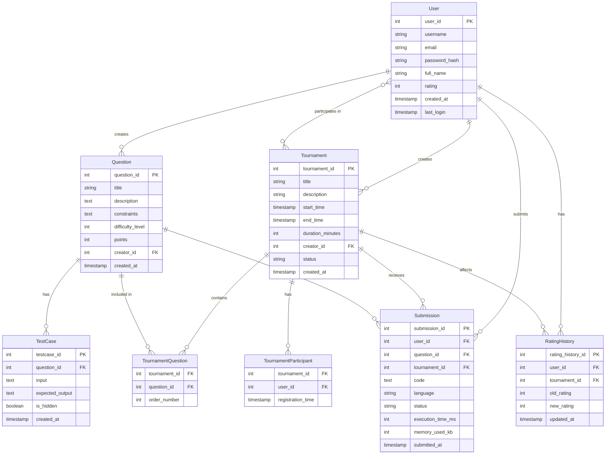
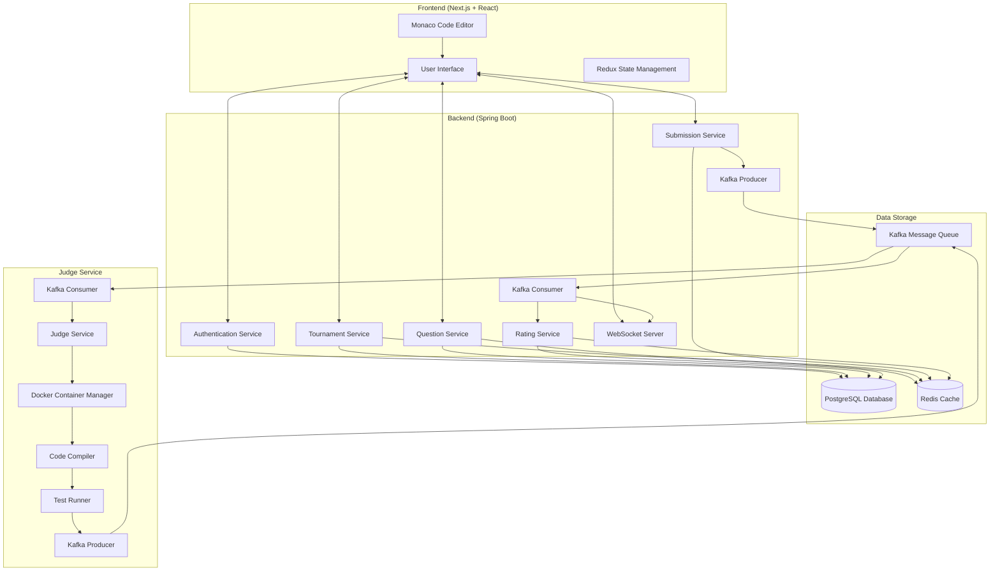
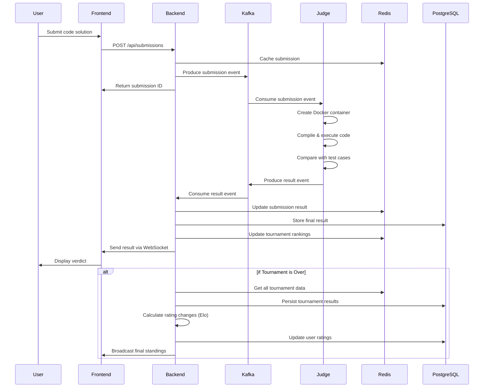
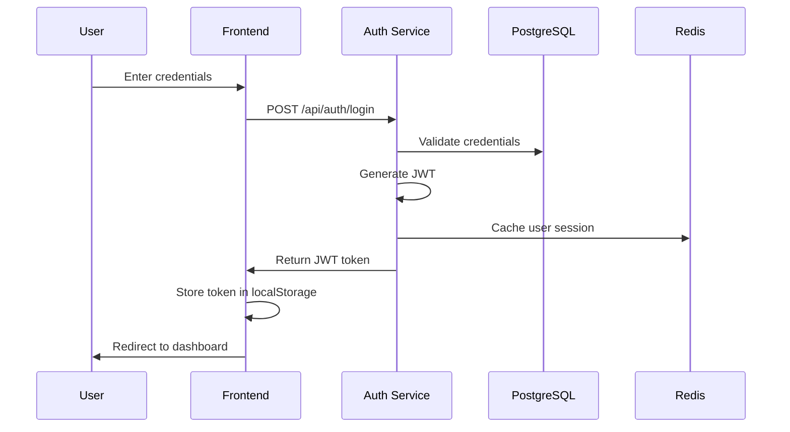
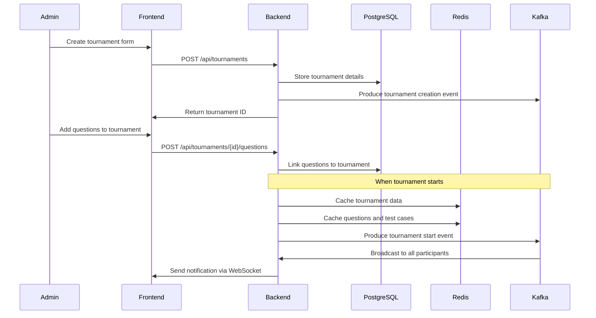

# CodeRush Database Schema

```mermaid
erDiagram
    User {
        int user_id PK
        string username
        string email
        string password_hash
        string full_name
        int rating
        timestamp created_at
        timestamp last_login
    }
    
    Tournament {
        int tournament_id PK
        string title
        string description
        timestamp start_time
        timestamp end_time
        int duration_minutes
        int creator_id FK
        string status
        timestamp created_at
    }
    
    Question {
        int question_id PK
        string title
        text description
        text constraints
        int difficulty_level
        int points
        int creator_id FK
        timestamp created_at
    }
    
    TestCase {
        int testcase_id PK
        int question_id FK
        text input
        text expected_output
        boolean is_hidden
        timestamp created_at
    }
    
    TournamentQuestion {
        int tournament_id FK
        int question_id FK
        int order_number
    }
    
    TournamentParticipant {
        int tournament_id FK
        int user_id FK
        timestamp registration_time
    }
    
    Submission {
        int submission_id PK
        int user_id FK
        int question_id FK
        int tournament_id FK
        text code
        string language
        string status
        int execution_time_ms
        int memory_used_kb
        timestamp submitted_at
    }
    
    RatingHistory {
        int rating_history_id PK
        int user_id FK
        int tournament_id FK
        int old_rating
        int new_rating
        timestamp updated_at
    }
    
    User ||--o{ Tournament : "creates"
    User ||--o{ Question : "creates"
    User ||--o{ Submission : "submits"
    User ||--o{ RatingHistory : "has"
    User }o--o{ Tournament : "participates in"
    Tournament ||--o{ TournamentQuestion : "contains"
    Tournament ||--o{ TournamentParticipant : "has"
    Tournament ||--o{ Submission : "receives"
    Tournament ||--o{ RatingHistory : "affects"
    Question ||--o{ TestCase : "has"
    Question ||--o{ TournamentQuestion : "included in"
    Question ||--o{ Submission : "receives"
```

# CodeRush System Architecture

```mermaid
graph TD
    subgraph "Frontend (Next.js + React)"
        UI[User Interface]
        Monaco[Monaco Code Editor]
        Redux[Redux State Management]
    end

    subgraph "Backend (Spring Boot)"
        Auth[Authentication Service]
        TournamentSvc[Tournament Service]
        QuestionSvc[Question Service]
        SubmissionSvc[Submission Service]
        RatingSvc[Rating Service]
        WebSocket[WebSocket Server]
        KafkaProducer[Kafka Producer]
        KafkaConsumer[Kafka Consumer]
    end

    subgraph "Judge Service"
        JudgeSvc[Judge Service]
        DockerManager[Docker Container Manager]
        Compiler[Code Compiler]
        TestRunner[Test Runner]
        JudgeKafkaConsumer[Kafka Consumer]
        JudgeKafkaProducer[Kafka Producer]
    end

    subgraph "Data Storage"
        PostgreSQL[(PostgreSQL Database)]
        Redis[(Redis Cache)]
        Kafka[Kafka Message Queue]
    end

    UI <--> WebSocket
    UI <--> Auth
    UI <--> TournamentSvc
    UI <--> QuestionSvc
    UI <--> SubmissionSvc
    Monaco --> UI

    Auth --> PostgreSQL
    TournamentSvc --> PostgreSQL
    QuestionSvc --> PostgreSQL
    SubmissionSvc --> KafkaProducer
    RatingSvc --> PostgreSQL
    
    TournamentSvc --> Redis
    QuestionSvc --> Redis
    SubmissionSvc --> Redis
    RatingSvc --> Redis
    
    KafkaProducer --> Kafka
    Kafka --> KafkaConsumer
    Kafka --> JudgeKafkaConsumer
    
    JudgeKafkaConsumer --> JudgeSvc
    JudgeSvc --> DockerManager
    DockerManager --> Compiler
    Compiler --> TestRunner
    TestRunner --> JudgeKafkaProducer
    JudgeKafkaProducer --> Kafka
    
    KafkaConsumer --> WebSocket
    KafkaConsumer --> RatingSvc
```

## System Flow for Code Submission

```mermaid
sequenceDiagram
    participant User
    participant Frontend
    participant Backend
    participant Kafka
    participant Judge
    participant Redis
    participant PostgreSQL
    
    User->>Frontend: Submit code solution
    Frontend->>Backend: POST /api/submissions
    Backend->>Redis: Cache submission
    Backend->>Kafka: Produce submission event
    Backend->>Frontend: Return submission ID
    
    Kafka->>Judge: Consume submission event
    Judge->>Judge: Create Docker container
    Judge->>Judge: Compile & execute code
    Judge->>Judge: Compare with test cases
    Judge->>Kafka: Produce result event
    
    Kafka->>Backend: Consume result event
    Backend->>Redis: Update submission result
    Backend->>PostgreSQL: Store final result
    Backend->>Redis: Update tournament rankings
    Backend->>Frontend: Send result via WebSocket
    Frontend->>User: Display verdict
    
    alt if Tournament is Over
        Backend->>Redis: Get all tournament data
        Backend->>PostgreSQL: Persist tournament results
        Backend->>Backend: Calculate rating changes (Elo)
        Backend->>PostgreSQL: Update user ratings
        Backend->>Frontend: Broadcast final standings
    end
```

## Authentication Flow

```mermaid
sequenceDiagram
    participant User
    participant Frontend
    participant Auth Service
    participant PostgreSQL
    participant Redis
    
    User->>Frontend: Enter credentials
    Frontend->>Auth Service: POST /api/auth/login
    Auth Service->>PostgreSQL: Validate credentials
    Auth Service->>Auth Service: Generate JWT
    Auth Service->>Redis: Cache user session
    Auth Service->>Frontend: Return JWT token
    Frontend->>Frontend: Store token in localStorage
    Frontend->>User: Redirect to dashboard
```

## Tournament Creation Flow

```mermaid
sequenceDiagram
    participant Admin
    participant Frontend
    participant Backend
    participant PostgreSQL
    participant Redis
    participant Kafka
    
    Admin->>Frontend: Create tournament form
    Frontend->>Backend: POST /api/tournaments
    Backend->>PostgreSQL: Store tournament details
    Backend->>Kafka: Produce tournament creation event
    Backend->>Frontend: Return tournament ID
    
    Admin->>Frontend: Add questions to tournament
    Frontend->>Backend: POST /api/tournaments/{id}/questions
    Backend->>PostgreSQL: Link questions to tournament
    
    Note over Backend,Kafka: When tournament starts
    Backend->>Redis: Cache tournament data
    Backend->>Redis: Cache questions and test cases
    Backend->>Kafka: Produce tournament start event
    Kafka->>Backend: Broadcast to all participants
    Backend->>Frontend: Send notification via WebSocket
```
